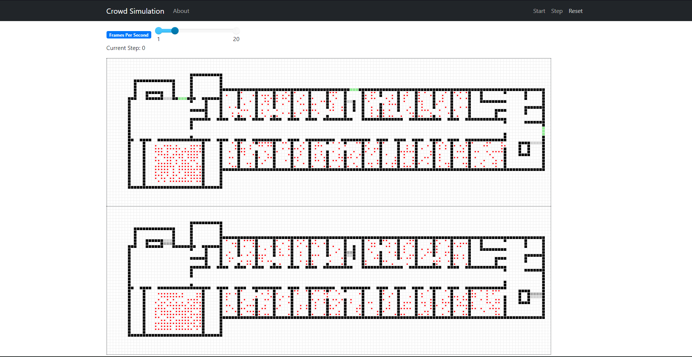
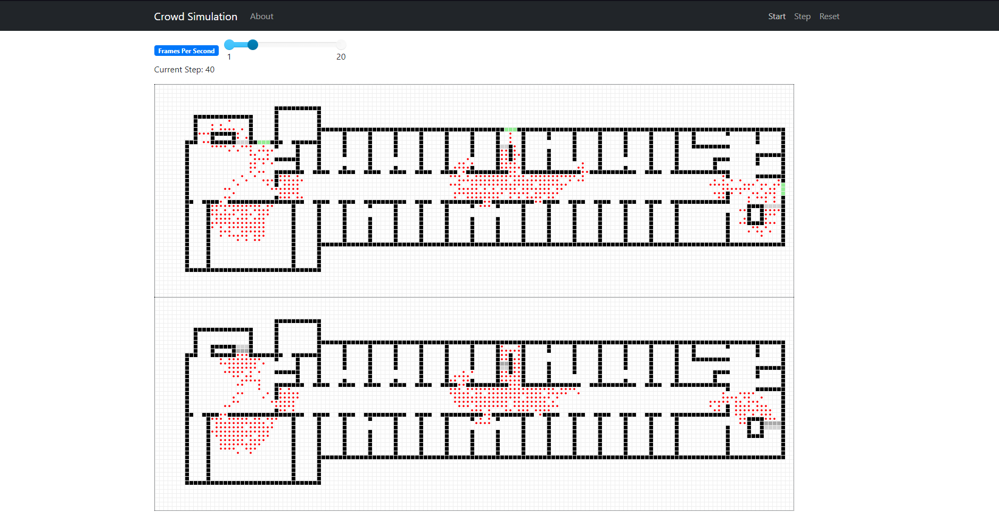

# Crowd Simulation - Symulacja Systemów Dyskretnych

## Opis
Celem projektu jest modelowanie zachowań ludzi podczas ewakuacji i analiza różnych scenariuszy ewakuacyjnych.  
Symulacja obejmuje dwa piętra budynku C2 na terenie AGH.  
Wykorzystano system agentowy i automat komórkowy  
Implementacja wykonana jest w języku Python z wykorzystaniem biblioteki Mesa.  

## Wymagania
Python 3.12  
Mesa 2.1.5 `pip install mesa`  
## Użycie
`python simulation.py`

## Widok symulacji

